# Remote Management System

A comprehensive guide for adding and managing virtual machines in a remote management system.

## Table of Contents

- [Prerequisites](#prerequisites)
- [Network Configuration](#network-configuration)
  - [Linux Configuration](#linux-configuration)
  - [Windows Configuration](#windows-configuration)
- [SSH Server Setup](#ssh-server-setup)
  - [Windows SSH Setup](#windows-ssh-setup)
  - [Linux SSH Setup](#linux-ssh-setup)
- [Authentication Configuration](#authentication-configuration)
  - [Linux: Public Key Authentication](#linux-public-key-authentication)
  - [Windows: Password Authentication](#windows-password-authentication)
- [System Requirements](#system-requirements)
- [Logs](#logs)

## Prerequisites

Both operating systems require a host-only network interface to communicate with the host machine. A static IP address must be configured to ensure consistent connectivity and allow the virtual machines saved in `host.conf` to be accessible.
Have the following dependencies installed on the host machine:
- A linux distribution to run the remote management interface (is a bash script).
- `sshpass` to facilitate password-based SSH authentication for Windows VMs.
- `ssh` client to connect to the virtual machines.
- `dialog` to provide a user-friendly interface for the remote management system.


## Network Configuration

### Linux Configuration

Edit the network configuration file `/etc/netplan/01-netcfg.yaml` (or similar) and add the following configuration:

```yaml
network:
  version: 2
  ethernets:
    enp0s8:
      dhcp4: no
      addresses: [192.168.56.101/24]
```

Apply the configuration with:
```bash
sudo netplan apply
```

### Windows Configuration

1. Open **Network Connections** in network settings
2. Right-click the network interface and select **Properties**
3. Select **Internet Protocol Version 4 (TCP/IPv4)** and click **Properties**

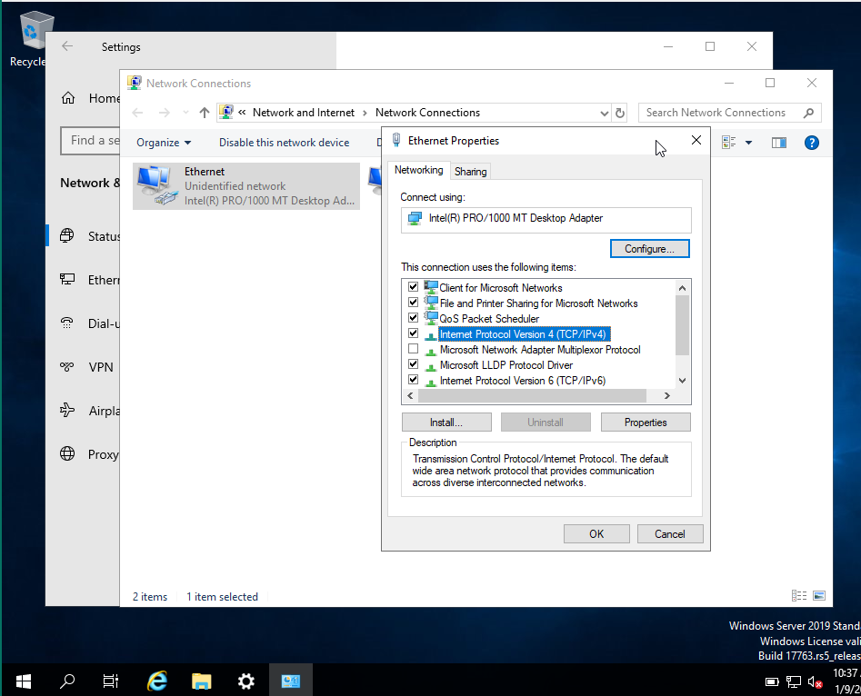

4. Configure the static IP settings:
   - IP address: `192.168.56.101` (or desired static IP)
   - Subnet mask: `255.255.255.0`
   - Other fields can be left empty if not needed

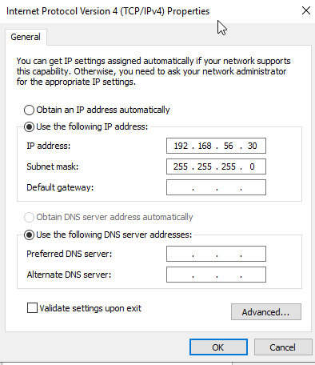

## SSH Server Setup

### Windows SSH Setup

#### Installation

1. Go to **Settings** → **Apps** → **Apps & features** → **Optional features**

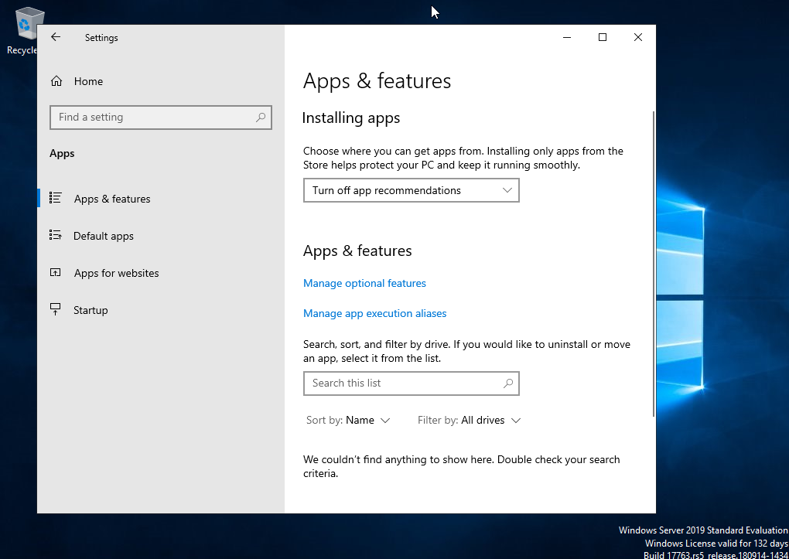

2. Click **Add a feature** and search for **OpenSSH Server**

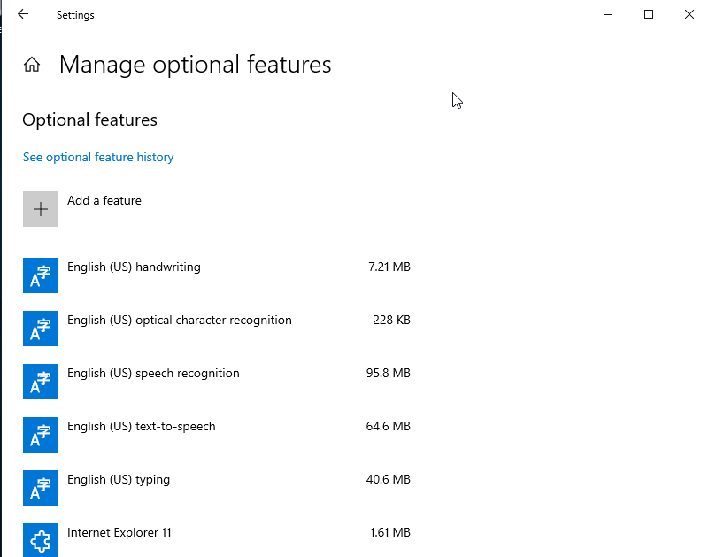

3. Click **Install**

#### Service Configuration

1. Open `services.msc`
2. Find **OpenSSH SSH Server**
3. Set **Startup type** to **Automatic**

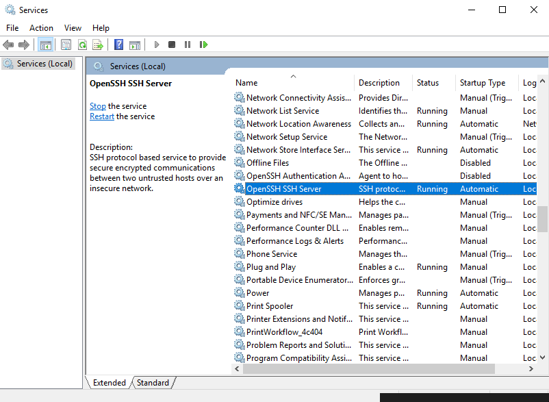

#### Firewall Configuration

**SSH Rule**: Windows Server 2019 ISOs typically include an SSH firewall rule by default. Verify it exists or create one if needed.

**ICMP Rule (Required for Ping, since on Windows is blocked by default)**: The remote management interface needs to ping machines to check if they're online. Create a new inbound rule to allow ICMP traffic:

1. Open **Windows Defender Firewall with Advanced Security**
2. Click **Inbound Rules** → **New Rule**
3. Configure as follows:

   **Rule Type**: Select **Custom**
   
   

   **Program**: Select **All programs**
   
   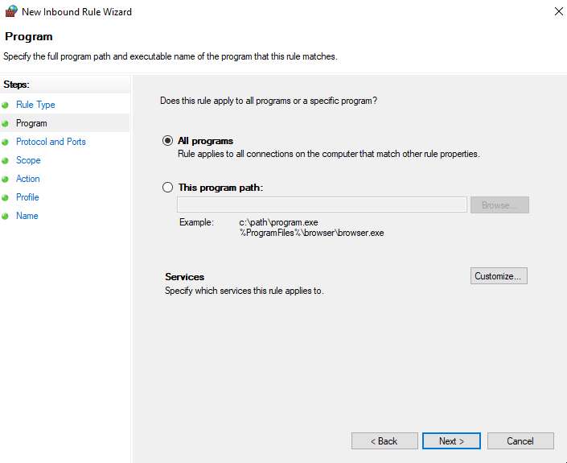

   **Protocol and Ports**: Set Protocol type to **ICMPv4** (this enables ping)
   
   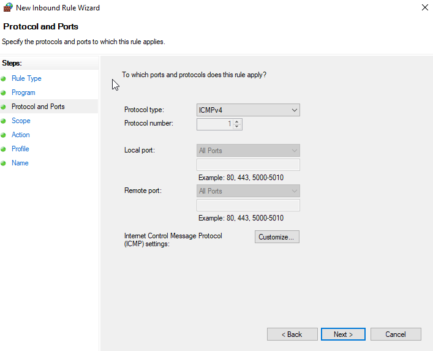

   **Scope**: Leave default settings
   
   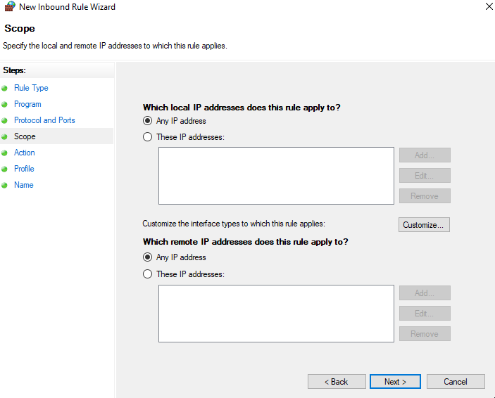

   **Action**: Select **Allow the connection**
   
   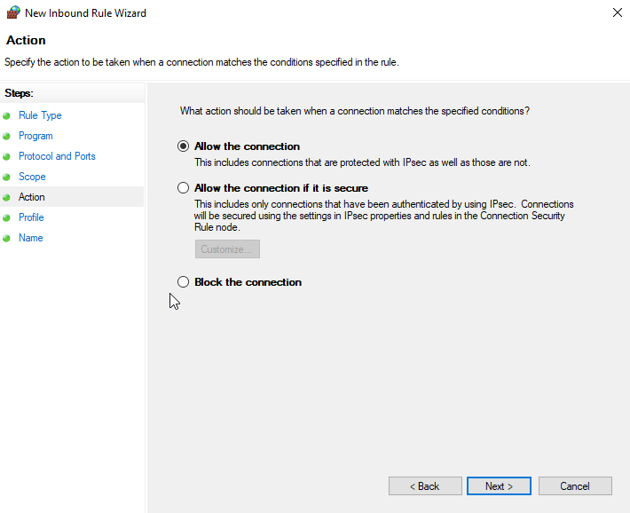

   **Profile**: Select all three options (Domain, Private, Public)
   
   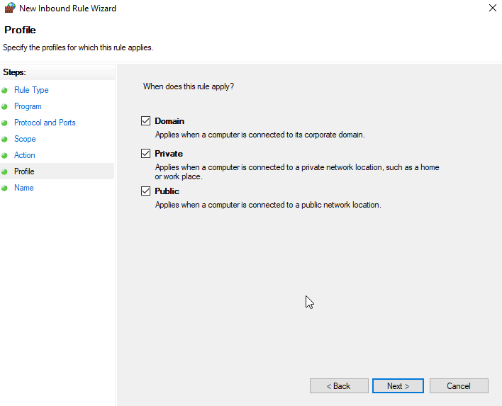

   **Name**: Give the rule a descriptive name and save
   
   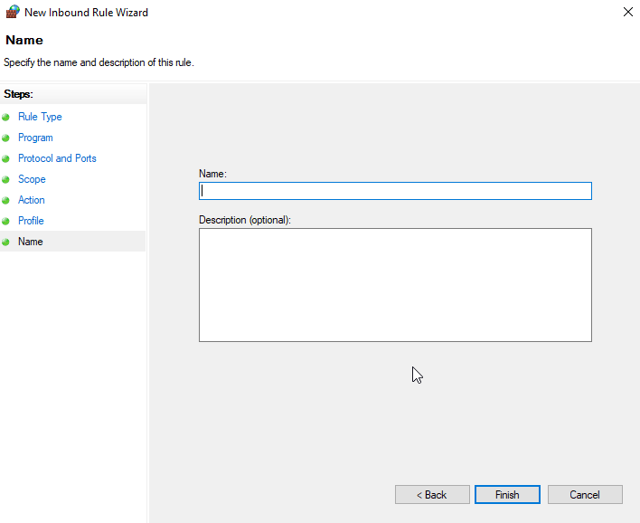

### Linux SSH Setup

#### Installation

OpenSSH server usually comes pre-installed. If not, install it with:

```bash
sudo apt install openssh-server
```

#### Verify Service Status

```bash
sudo systemctl status ssh
```

If not running, start and enable it:

```bash
sudo systemctl start ssh
sudo systemctl enable ssh
```

#### Firewall Configuration

Ping (ICMP) is typically allowed by default on Ubuntu ISOs used in the course. If needed, configure your firewall to allow ICMP traffic.

## Authentication Configuration

You can now connect via SSH from the host to the virtual machines using the administrator or root user, depending on the operating system. Linux will use public key authentication, while Windows will use password authentication with `sshpass`.

### Linux: Public Key Authentication

#### On the Virtual Machine

```bash
# Enable root login via SSH
sudo nano /etc/ssh/sshd_config
# Uncomment: PermitRootLogin yes

# Restart SSH service
sudo systemctl restart sshd

# Set root password
sudo passwd root
```

#### On the Host Machine

```bash
# Generate SSH key pair
ssh-keygen -t rsa -b 4096 -C "name@control"

# Copy public key to virtual machine
ssh-copy-id root@192.168.56.20

# Test connection (should not prompt for password)
ssh root@192.168.56.20
```

### Windows: Password Authentication

#### On the Virtual Machine

Open PowerShell as Administrator and execute:

```powershell
# Edit SSH configuration
notepad C:\ProgramData\ssh\sshd_config
# Ensure this line is present and uncommented:
# PermitRootLogin yes

# Also ensure password authentication is enabled:
# PasswordAuthentication yes

# Restart SSH service
Restart-Service sshd
```

#### On the Host Machine

You should now be able to connect using the administrator user and the password set during Windows installation:

```bash
sshpass -p "AdministratorPassword" ssh admin@192.168.56.20
```

**Note**: Replace `AdministratorPassword` with the actual administrator password.

## Adding Hosts to hosts.conf

The `hosts.conf` file (in the project root) defines all managed machines. Add each host using this format:

```
<hostname>|<ip_address>|<os>
```

### Example hosts.conf:

```
windows2|192.168.56.40|windows
linux1|192.168.56.10|linux
linux2|192.168.56.20|linux
windows1|192.168.56.30|windows
```

### Format Notes:

- **hostname**: A descriptive name for the machine (e.g., `linux1`, `windows2`).
- **ip_address**: The static IP of the VM's management interface.
- **os**: Must be `linux` or `windows` (lowercase). This determines which scripts and commands are sent.
- One host per line; use pipe `|` as the delimiter.


## System Requirements

The remote management interface must support the following capabilities:

### Target Selection
- Execute commands on a specific machine
- Execute commands on multiple machines
- Execute commands on all machines

### Remote Execution
- Execute any program available on the remote machine
- Run custom scripts
- Execute shell commands (bash) or PowerShell commands

### Built-in Operations
The system provides the following pre-configured operations:
- **reboot** - Restart the remote machine
- **shutdown** - Power off the remote machine
- **download and install updates** - Update the system

### System Monitoring
- **current status** - Check if machine is online/offline
- **cpu and memory usage** - Display resource utilization
- **available disk space** - Show storage information

## Logs

The system must include an option to view logs of remote operations:
- Logs are stored in the `/logs` directory
- Logs track all executed remote operations